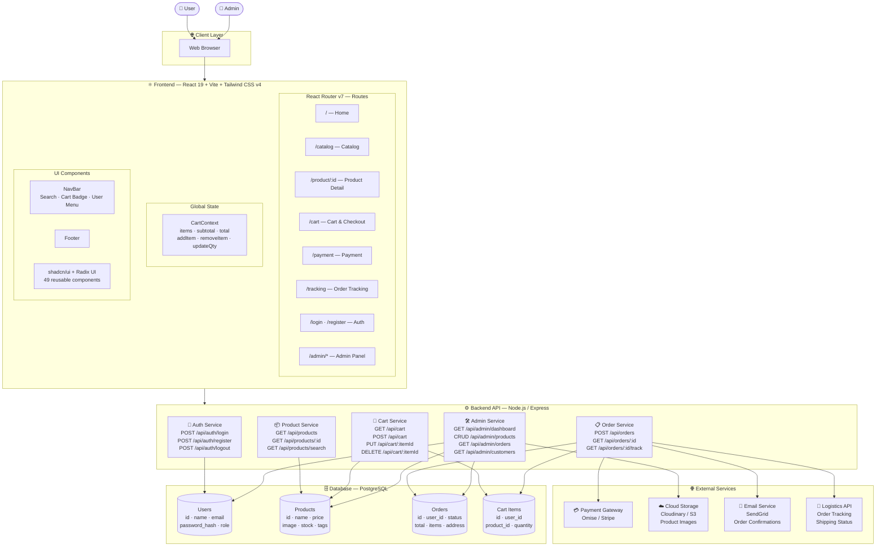
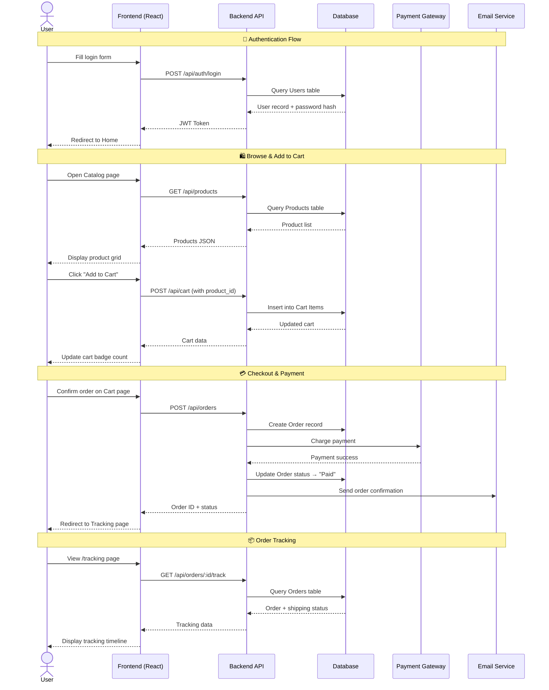

# System Design — Group 5 E-Commerce App

## 1. System Design Diagram

---

## 2. API Specification

| Method | Endpoint | Description | Auth Required |
|--------|----------|-------------|---------------|
| POST | `/api/auth/register` | Create new user account | No |
| POST | `/api/auth/login` | Login, returns JWT token | No |
| POST | `/api/auth/logout` | Invalidate session | Yes |
| GET | `/api/products` | List all products (with filter/search/pagination) | No |
| GET | `/api/products/:id` | Get single product detail | No |
| GET | `/api/products/search?q=` | Search products by keyword | No |
| GET | `/api/cart` | Get current user's cart | Yes |
| POST | `/api/cart` | Add item to cart | Yes |
| PUT | `/api/cart/:itemId` | Update item quantity | Yes |
| DELETE | `/api/cart/:itemId` | Remove item from cart | Yes |
| POST | `/api/orders` | Place order (triggers payment) | Yes |
| GET | `/api/orders/:id` | Get order detail | Yes |
| GET | `/api/orders/:id/track` | Get real-time tracking status | Yes |
| GET | `/api/admin/dashboard` | Sales stats & analytics | Admin |
| GET | `/api/admin/products` | List all products | Admin |
| POST | `/api/admin/products` | Create new product | Admin |
| PUT | `/api/admin/products/:id` | Update product | Admin |
| DELETE | `/api/admin/products/:id` | Delete product | Admin |
| GET | `/api/admin/orders` | List all orders | Admin |
| PATCH | `/api/admin/orders/:id/status` | Update order status | Admin |
| GET | `/api/admin/customers` | List all customers | Admin |

---

## 3. Frontend–Backend Interaction Diagram

---

## Architecture Summary

| Layer | Technology | Purpose |
|-------|-----------|---------|
| Frontend | React 19 + Vite + Tailwind CSS v4 | UI rendering, routing, state |
| State Management | React Context (CartContext) | Global cart state |
| Component Library | shadcn/ui + Radix UI | Accessible UI components |
| Backend | Node.js + Express | REST API, business logic |
| Database | PostgreSQL | Persistent data storage |
| Auth | JWT (JSON Web Token) | Stateless authentication |
| Payment | Omise / Stripe | Secure payment processing |
| Storage | Cloudinary / AWS S3 | Product image hosting |
| Email | SendGrid | Transactional emails |
| Tracking | Logistics API | Real-time shipping status |
